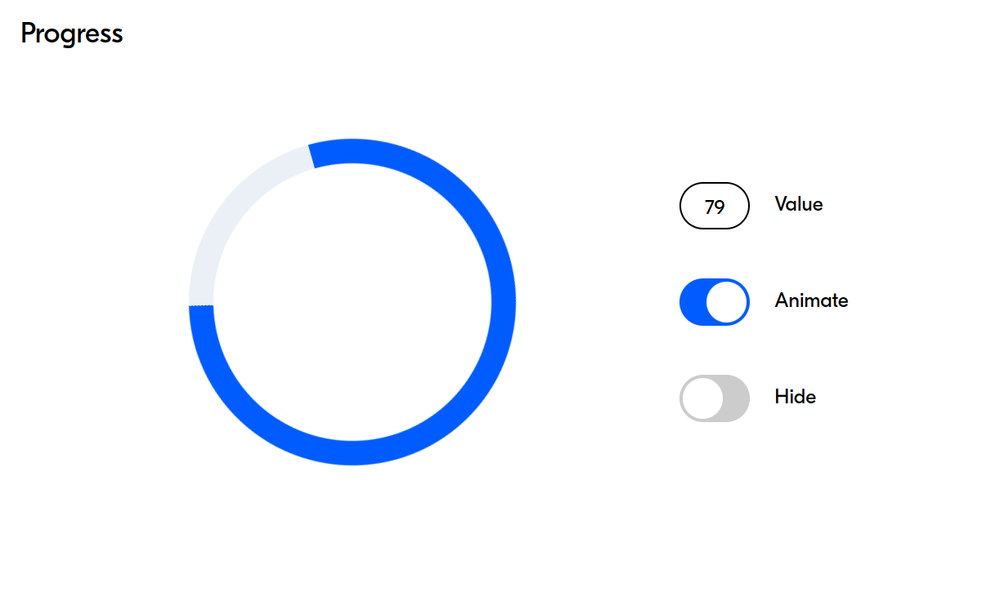

# Reusable Progress block

Ссылка на проект: https://mrspop.github.io/Reusable-Progress-block/

## API

ProgressPrototype(id) - возвращает новый экземпляр ProgressPrototype.

 - parentId - ID элемента, к которому будет прикреплен прогресс-блок.
 - value - принимает число от 0 до 100, определяет процент заполнения круга дугой.
 - isAnimated - флаг, при наличии активирует анимацию вращения.
 - isHidden - флаг, при наличии делает компонент полностью прозрачным.

## Проект

